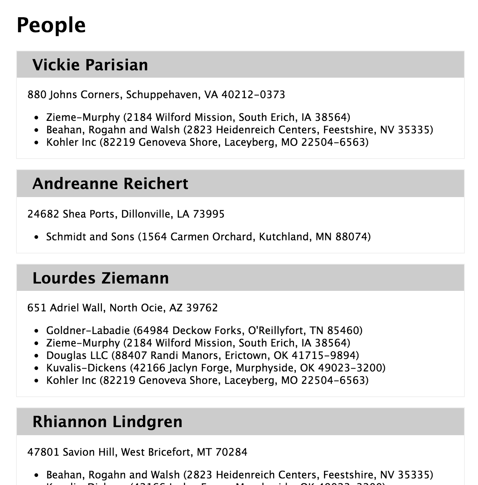

# Using associated data in views

## Setup

1. Fork and clone
1. `npm install`
1. `node db/seeds.js`
1. `nodemon`

## Set the Stage

How many Chrome tabs do you have open?  How many terminal tabs?  How many Atom editors?  As you go through this exercise, all those open tabs might start to feel like detritus, littering your workspace with attention-stealing distractions.  If so, close'em all down :)

## Objectives

By the end of this lesson you should be able to:

- Use a javascript algorithm to build a set of objects that are easy for a view to use

## Activity

Imagine you have the CRM app that tracks people.  People have an address, and multiple employers.  Employers also have an address.

- people
  - name
  - addressId
  - employerIds
- addresses
  - line1
  - cityStateZip
- employers
  - name
  - addressId

Your goal is to eventually show

- all people
- their addresses
- their employers
- their employers addresses

all on one page, using Handlebars (a logicless templating engine).

Here's what the view wants to look like:

```hbs
{{#each people}}
  <section>
    <h1>{{name}}</h1>
    <p class="address">{{address.line1}}, {{address.cityStateZip}}</p>
    <ul>
      {{#each employers}}
        <li>
          {{name}} ({{address.line1}}, {{address.cityZipZip}})
        </li>
      {{/each}}
    </ul>
  </section>
{{/each}}
```

## Step 1: Grok the problem

Take a look at the view code above.  That view code assumes that you can do things like this:

```js
person.name                 // returns the name from the people collection
person.address              // returns an address object from the address collection
person.employers            // returns an array of employer objects from the employers collection
person.employers[0].address // returns an address from the addresses collection
```

Whoa.  Documents in the `people` collection don't have an `address` property - they only have an `addressId` property.  Those `people` documents also don't have an `employers` property.  Let's break this down...

## Step 2: Solve for 1

To start, it says you have to get _all_ people and their addresses.  Let's just see if we can do this for _one_ person and that one person's address, and then make it more general.

1. Go to `01_simple_find.js` and write a monk query to find a single person by some `name` or `_id` and log that out.
1. Using the promise that monk returns you, find the address based on the person's address and log that out.

So far so good - that's the easy part.  Now take a look at the problem again - notice how we need to say things like `person.address` - now look at your log output.  There's no address property on the person doc.  But you can log the person, and you can log the address.  So how do you merge them?

Easy!  Just set the `person`'s `address` property:

```js
person.address = address
```

Get it?  If not, head over to `02_simple_find.js` to see what I mean.

## Step 3: Solve for 1

OK - you have code that works for 1.  Now you need to make it work for the whole array of people.  So in your `01_simple_find.js` file, change that `findOne` call to a `find`.

So now you have an array of people, and you need to get _each_ one's address.  That is, you need to find all the addresses where the `_id` of the address matches the `person.addressId` and then connect the addresses to the person.

Ugh.  That still seems really big.  What are some smaller problems you can solve?  Take a minute to break some of them out before moving forward.

Here are a few smaller problems:

1. get an array of `addressId`s from the people
1. find all addresses whose ids are in that array
1. match them up appropriately

**Get addressIds from people**

If you have an array like this:

```js
[
  {_id: 'abc', name: 'Joe'},
  {_id: 'def', name: 'Sue'},
  {_id: 'ghi', name: 'Zoe'}
]
```

How would you get just an array of their `_id`s?  Go to `02_people_and_addresses.js` and solve that problem.

Got it working?  How did you do it?  There are a few different ways - one is a `for` loop, and another is to `map`.

**Find all addresses with specific ids**

You know how to query for a document where a property matches a single value.  How do you query for all documents that match multiple property values?  Check out these docs:

http://docs.mongodb.org/manual/reference/operator/query/in/#op._S_in

Back in `02_people_and_addresses.js`, add a query for all addresses where the addresses match the addressIds of the people you just got.

**Match them up**

OK - so now here's effectively what you have:

```js
var people = [
  {_id: 'abc', name: 'Sue', addressId: '123'},
  {_id: 'def', name: 'Bob', addressId: '345'}
]

var addresses = [
  {_id: '123', line1: 'Elm St'},
  {_id: '345', line1: 'Main St'}
]
```

And here's the code you want to see:


```js
var people = [
  {_id: 'abc', name: 'Sue', addressId: '123', address: {_id: '123', line1: 'Elm St'}},
  {_id: 'def', name: 'Bob', addressId: '345', address: {_id: '345', line1: 'Main St'}}
]
```

Why do you want that again?  Because view code shouldn't have to deal with those kinds of algorithms and details.

This looks like a totally isolated algorithm problem.  In fact, this looks perfect for a spec.  Let's write that.

**Get Specs Setup**

To spec things, `jasmine` is a decent choice.  Head over to http://jasmine.github.io/2.0/node.html to see how to install it.

Once you run through those commands, you should see a `spec` directory.  What are you speccing again?  Oh right - a function that will take the `people` and `addresses` arrays, and add the appropriate `address` to `person`.

Add a new spec file from the command line, like so:

```
touch spec/people_address_spec.js
```

The over in `spec/people_address_spec.js` setup your test.  See if you can do it on your own.  HINT: look up above at the problem statement - there are examples of inputs and outputs.

If you are stuck, checkout `solutions/people_address_spec.js` for a potential solution.

Run your specs with `jasmine` at the command line.

**Put it all together**

Great!  Now you have all the pieces.  You can:

- find all people
- get an array of addressIds from your people
- query Mongo for all the addresses that match those addressIds
- set the `address` property on every person appropriately (with a well-tested function)

In `02_people_and_addresses.js` put all of those people together and `console.log` the output.

Run it!  How does it look?  If you are like most students, this fails.  It totally doesn't work.  Why?  Why oh why?  Take a few minutes to debug before moving onto the solution...

**Comparing ObjectIDs**

Mongo's `_id`s are objects, not strings.  So you probably had this line somewhere:

```js
  if(person.addressId === address._id) {
```

But what you need to do is this:

```js
  if(person.addressId.toString() === address._id.toString()) {
```

Now when you run `02_people_and_addresses.js` it should work!

## Step 4: Take it to the next level

Here's a refresher on what you need to to:

- all people
- their addresses
- their employers
- their employers addresses

all on one page, using Handlebars (a logicless templating engine).

Here's what the view code should look like:

```hbs
<h1>People</h1>
{{#each people}}
  <section>
    <h1>{{name}}</h1>
    <p class="address">{{address.line1}}, {{address.cityStateZip}}</p>
    <ul>
      {{#each employers}}
        <li>
          {{name}} ({{address.line1}}, {{address.cityZipZip}})
        </li>
      {{/each}}
    </ul>
  </section>
{{/each}}
```

Update `views/index.hbs` to look like the code above, and update `routes/index.js` to use the code you wrote from `02_people_and_addresses.js`, and extend it to include employers and their addresses.

Here's what it should look like:


